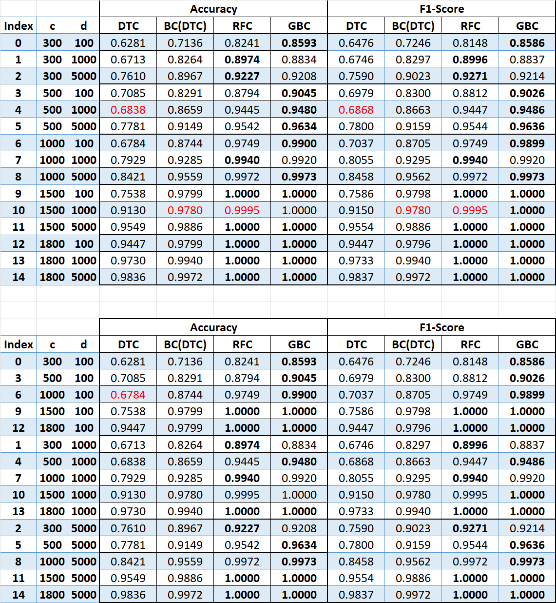
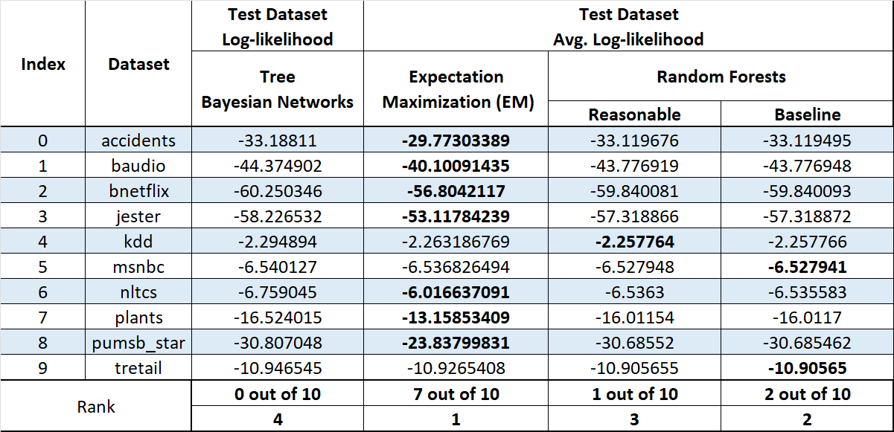

# Machine Learning

## Naive Bayes and Logistic Regression

| DataSets | Data       Representation |              Training   Algorithm               | Accuracy | Precision | Recall | F1 Score |
|:--------:|:-------------------------:|:-----------------------------------------------:|:--------:|:---------:|:------:|:--------:|
|  custom  |         Bernoulli         |              Discrete Naïve Bayes               |  82.22   |   80.00   | 46.15  |  58.54   |
|          |                           | Logistic Regression       (l=0.5, a=0.01, 1000) |  95.40   |   93.08   | 90.30  |  91.67   |
|          |                           |                  SGDClassifier                  |  95.19   |   99.23   | 85.43  |  91.81   |
|          |       Bag Of Words        |            Multinomial Naïve   Bayes            |  96.86   |   91.97   | 96.92  |  94.38   |
|          |                           | Logistic Regression       (l=0.9, a=0.01, 1000) |  93.72   |   90.00   | 87.31  |  88.64   |
|          |                           |                  SGDClassifier                  |  89.33   |   98.45   | 72.32  |  83.39   |
|  enron1  |         Bernoulli         |              Discrete Naïve Bayes               |  79.38   |   83.13   | 46.31  |  59.48   |
|          |                           | Logistic Regression      (l=0.7, a=0.01, 1000)  |  94.74   |   93.29   | 90.85  |  92.05   |
|          |                           |                  SGDClassifier                  |  94.96   |   97.99   | 87.95  |  92.70   |
|          |       Bag Of Words        |            Multinomial Naïve   Bayes            |  94.96   |   92.57   | 91.95  |  92.25   |
|          |                           | Logistic Regression      (l=0.9, a=0.01, 1000)  |  94.74   |   92.62   | 91.39  |  92.00   |
|          |                           |                  SGDClassifier                  |  94.30   |   95.97   | 87.73  |  91.67   |
|  enron4  |         Bernoulli         |              Discrete Naïve Bayes               |  89.32   |   92.58   | 92.58  |  92.58   |
|          |                           | Logistic Regression      (l=0.1, a=0.01, 1000)  |  96.50   |  100.00   | 95.36  |  97.63   |
|          |                           |                  SGDClassifier                  |  96.87   |  100.00   | 95.83  |  97.87   |
|          |       Bag Of Words        |            Multinomial Naïve   Bayes            |  88.21   |   96.85   | 86.44  |  91.35   |
|          |                           | Logistic Regression      (l=0.7, a=0.01, 1000)  |  95.39   |   99.74   | 94.20  |  96.89   |
|          |                           |                  SGDClassifier                  |  94.66   |   99.49   | 93.51  |  96.41   |

## Collaborative Filtering

There are two types of filtering for recommender systems.

1. Content-Based filtering
2. Collaborative Filtering

Content-Based filtering recommends the items based on the user’s actions or feedback on previous items.\

Collaborative Filtering uses similarities between users and items simultaneously to provide recommendations.
Collaborative Filtering models can recommend an item to user based on the interests or feedback of a similar user.\

Now implemented the Collaborative filtering and ran on the Netflix ratings data.
Used NumPy library in Python for faster processing of the data.\

First converted the training data into pivot table of (users x movies) matrix and calculated the 𝑣𝑣, user mean rating
of the movies he rated, and calculated the mean difference matrix.
Later, using mean difference matrix calculated the Numerator part and Denominator part of the Correlation Weights
separately using the APIs of the numpy for multi-dimensional arrays. Later calculated the kappa using the calculated
weights. Finally, computed the predictions for the active user on the movies using the above calculated values.\

With precomputed predictions and test data, predicted the ratings of the user for the movies. Using the predicted
ratings and actual ratings calculated the mean absolute error and root mean squared error. The results are as
follows.\
Mean Absolute Error (MAE): 0.746\
Root Mean Squared Error (RMSE): 0.941\

The RMSE is more than MAE then there might be large difference in the error or there might be more outliers in the
data.\

The time took to do the predictions and calculations on machine with 16GB RAM is 467 seconds. Whereas, the same ran
on a machine with more than 32GB RAM it took around 40 seconds only.\

## Neural Networks K-Nearest Neighbors and Support Vector Machines

### Neural Networks - MLP

| Index |  Hyper-Parameters  |            |        | Error Rate (%) | Run Time (Sec) |
|:-----:|:------------------:|:----------:|:------:|:--------------:|:--------------:|
|       | hidden_layer_sizes | activation | solver |                |                |
|   1   |       (300,)       |    tanh    |  sgd   |      3.47      |    551.679     |
|   2   |       (300,)       |    tanh    |  adam  |      2.86      |     108.31     |
|   3   |       (300,)       |    relu    |  sgd   |      2.56      |    463.205     |
|   4   |       (300,)       |    relu    |  adam  |      2.77      |     95.349     |
|   5   |     (200, 200)     |    tanh    |  sgd   |      3.52      |    603.176     |
|   6   |     (200, 200)     |    tanh    |  adam  |      2.73      |    104.326     |
|   7   |     (200, 200)     |    relu    |  sgd   |      2.69      |    414.932     |
|   8   |     (200, 200)     |    relu    |  adam  |      2.00      |     86.073     |
|   9   |   (200, 100, 50)   |    tanh    |  sgd   |      3.51      |    435.265     |
|  10   |   (200, 100, 50)   |    tanh    |  adam  |      2.88      |     86.132     |
|  11   |   (200, 100, 50)   |    relu    |  sgd   |      2.90      |    251.742     |
|  12   |   (200, 100, 50)   |    relu    |  adam  |      2.19      |    108.129     |

### K-NNs

| Index | Hyper-Parameters |           |          | Error Rate (%) | Run Time (Sec) |
|:-----:|:----------------:|:---------:|:--------:|:--------------:|:--------------:|
|       |   n_neighbors    |  metric   | weights  |                |                |
|   1   |        3         | euclidean | uniform  |      5.50      |     4.001      |
|   2   |        3         | euclidean | distance |      5.34      |     2.923      |
|   3   |        3         | manhattan | uniform  |      4.09      |    2654.114    |
|   4   |        3         | manhattan | distance |      4.11      |    1582.564    |
|   5   |        5         | euclidean | uniform  |      5.59      |     1.875      |
|   6   |        5         | euclidean | distance |      5.50      |     1.809      |
|   7   |        5         | manhattan | uniform  |      4.27      |    1526.046    |
|   8   |        5         | manhattan | distance |      4.13      |    1479.739    |
|   9   |        9         | euclidean | uniform  |      5.72      |     1.895      |
|  10   |        9         | euclidean | distance |      5.60      |     1.889      |
|  11   |        9         | manhattan | uniform  |      4.53      |    1482.351    |
|  12   |        9         | manhattan | distance |      4.47      |    1481.343    |

### SVMs

| Index | Hyper-Parameters |     |         | Error Rate (%) | Run Time (Sec) |
|:-----:|:----------------:|:---:|:-------:|:--------------:|:--------------:|
|       |      kernel      |  C  |  gamma  |                |                |
|   1   |      linear      |  1  | Default |      7.06      |     20.054     |
|   2   |      linear      | 10  | Default |      7.33      |    183.115     |
|   3   |      linear      | 100 | Default |      7.64      |    2118.856    |
|   4   |       rbf        |  1  | 0.0001  |      6.34      |     9.671      |
|   5   |       rbf        |  1  | 0.0010  |      3.42      |     8.685      |
|   6   |       rbf        |  1  | 0.0100  |     14.23      |     25.757     |
|   7   |       rbf        |  5  | 0.0001  |      5.02      |     8.073      |
|   8   |       rbf        |  5  | 0.0010  |      2.72      |     8.424      |
|   9   |       rbf        |  5  | 0.0100  |     13.31      |     27.123     |
|  10   |       rbf        | 10  | 0.0001  |      4.74      |      7.82      |
|  11   |       rbf        | 10  | 0.0010  |      2.68      |     8.046      |
|  12   |       rbf        | 10  | 0.0100  |     13.31      |     27.092     |
|  13   |     sigmoid      |  1  | 0.0001  |      7.01      |    818.726     |
|  14   |     sigmoid      |  1  | 0.0010  |      8.65      |    393.926     |
|  15   |     sigmoid      |  1  | 0.0100  |     43.67      |    821.123     |
|  16   |     sigmoid      |  5  | 0.0001  |      5.91      |    525.568     |
|  17   |     sigmoid      |  5  | 0.0010  |     10.63      |    228.977     |
|  18   |     sigmoid      |  5  | 0.0100  |     43.41      |    899.302     |
|  19   |     sigmoid      | 10  | 0.0001  |      5.61      |    342.351     |
|  20   |     sigmoid      | 10  | 0.0010  |     11.17      |     235.85     |
|  21   |     sigmoid      | 10  | 0.0100  |     43.47      |    789.173     |

## TreeClassifiers and K-Means Clustering

### K-Means Clustering

| Index    | K   | Seed     | Img Size(KB) | Comp. Ratio | Run Time(s) |
|----------|-----|----------|--------------|-------------|-------------|
| Koala    | NaN | NaN      | 762.530273   | 1           | NaN         |
| 1        | 2   | 8.19E+03 | 101.744141   | 7.494587    | 20.197      |
| 2        | 2   | 1.31E+05 | 49.439453    | 15.423518   | 20.239      |
| 3        | 2   | 5.24E+05 | 14.797852    | 51.529796   | 19.989      |
| 4        | 2   | 6.70E+06 | 71.267578    | 10.69954    | 19.884      |
| 5        | 2   | 2.15E+09 | 57.572266    | 13.24475    | 19.627      |
| 6        | 5   | 8.19E+03 | 169.838867   | 4.489728    | 40.857      |
| 7        | 5   | 1.31E+05 | 172.125977   | 4.430071    | 40.608      |
| 8        | 5   | 5.24E+05 | 171.222656   | 4.453443    | 40.172      |
| 9        | 5   | 6.70E+06 | 176.457031   | 4.321337    | 40.332      |
| 10       | 5   | 2.15E+09 | 172.886719   | 4.410578    | 40.057      |
| 11       | 10  | 8.19E+03 | 166.579102   | 4.577587    | 74.603      |
| 12       | 10  | 1.31E+05 | 183.522461   | 4.15497     | 74.236      |
| 13       | 10  | 5.24E+05 | 173.009766   | 4.407441    | 74.119      |
| 14       | 10  | 6.70E+06 | 169.119141   | 4.508835    | 73.716      |
| 15       | 10  | 2.15E+09 | 174.396484   | 4.372395    | 73.745      |
| 16       | 15  | 8.19E+03 | 160.897461   | 4.739231    | 106.479     |
| 17       | 15  | 1.31E+05 | 161.618164   | 4.718098    | 107.09      |
| 18       | 15  | 5.24E+05 | 166.891602   | 4.569015    | 106.517     |
| 19       | 15  | 6.70E+06 | 165.476562   | 4.608086    | 106.764     |
| 20       | 15  | 2.15E+09 | 166.170898   | 4.588832    | 106.681     |
| 21       | 20  | 8.19E+03 | 173.358398   | 4.398577    | 139.736     |
| 22       | 20  | 1.31E+05 | 152.97168    | 4.984781    | 139.542     |
| 23       | 20  | 5.24E+05 | 154.638672   | 4.931045    | 144.942     |
| 24       | 20  | 6.70E+06 | 163.265625   | 4.670489    | 145.056     |
| 25       | 20  | 2.15E+09 | 164.164062   | 4.644928    | 141.162     |
| Penguins | NaN | NaN      | 759.604492   | 1           | NaN         |
| 1        | 2   | 8.19E+03 | 58.172852    | 13.057715   | 19.94       |
| 2        | 2   | 1.31E+05 | 65.112305    | 11.666067   | 20.038      |
| 3        | 2   | 5.24E+05 | 19.917969    | 38.136644   | 19.648      |
| 4        | 2   | 6.70E+06 | 53.048828    | 14.318968   | 20.099      |
| 5        | 2   | 2.15E+09 | 52.643555    | 14.429202   | 19.792      |
| 6        | 5   | 8.19E+03 | 83.258789    | 9.123415    | 40.985      |
| 7        | 5   | 1.31E+05 | 97.194336    | 7.815316    | 41.167      |
| 8        | 5   | 5.24E+05 | 100.501953   | 7.558107    | 40.252      |
| 9        | 5   | 6.70E+06 | 117.540039   | 6.462517    | 41.656      |
| 10       | 5   | 2.15E+09 | 105.175781   | 7.222238    | 40.37       |
| 11       | 10  | 8.19E+03 | 112.646484   | 6.74326     | 74.309      |
| 12       | 10  | 1.31E+05 | 117          | 6.492346    | 74.259      |
| 13       | 10  | 5.24E+05 | 108.030273   | 7.031404    | 73.908      |
| 14       | 10  | 6.70E+06 | 123.393555   | 6.15595     | 75.771      |
| 15       | 10  | 2.15E+09 | 116.888672   | 6.49853     | 75.45       |
| 16       | 15  | 8.19E+03 | 118.445312   | 6.413124    | 110.469     |
| 17       | 15  | 1.31E+05 | 120.27832    | 6.31539     | 108.646     |
| 18       | 15  | 5.24E+05 | 110.741211   | 6.859276    | 108.409     |
| 19       | 15  | 6.70E+06 | 115.958984   | 6.550631    | 108.746     |
| 20       | 15  | 2.15E+09 | 114.364258   | 6.641975    | 107.949     |
| 21       | 20  | 8.19E+03 | 114.269531   | 6.647481    | 140.036     |
| 22       | 20  | 1.31E+05 | 110.382812   | 6.881547    | 141.741     |
| 23       | 20  | 5.24E+05 | 113.376953   | 6.699814    | 140.923     |
| 24       | 20  | 6.70E+06 | 116.463867   | 6.522233    | 140.028     |
| 25       | 20  | 2.15E+09 | 113.393555   | 6.698833    | 140.516     |

### Tree Classifiers

#### MNIST
|                            | Sorted By Accuracies |             |             |             |
|----------------------------|:--------------------:|:-----------:|:-----------:|:-----------:|
|                            |         DTC          |   BC(DTC)   |     RFC     |     GBC     |
|                            |        0.7758        |   0.8856    |   0.9518    |   0.2851    |
|                            |        0.7899        |   0.8893    |   0.9573    |   0.6652    |
|                            |        0.7964        |   0.8898    |   0.9573    |   0.8159    |
|                            |        0.8086        |   0.8898    |   0.9599    |   0.8352    |
|                            |        0.822         |   0.8918    |   0.9613    |   0.8529    |
|                            |        0.8353        |   0.9187    |   0.9614    |   0.8642    |
|                            |        0.8356        |   0.9391    |    0.964    |   0.8674    |
|                            |        0.8507        |   0.9517    |   0.9642    |   0.8724    |
|                            |        0.8751        |   0.9517    |   0.9658    |    0.876    |
|                            |        0.8763        |   0.9531    |   0.9666    |   0.8829    |
|                            |        0.8855        |             |    0.967    |   0.9037    |
|                            |        0.8856        |             |    0.967    |   0.9131    |
|                            |                      |             |   0.9673    |   0.9167    |
|                            |                      |             |    0.968    |   0.9215    |
|                            |                      |             |   0.9691    |   0.9291    |
|                            |                      |             |   0.9694    |   0.9399    |
|                            |                      |             |   0.9698    |    0.94     |
|                            |                      |             |   0.9703    |   0.9505    |
| Average   of      Accuracy |        0.8364        |   0.91606   | 0.964305556 | 0.846205556 |
| Variance       of Accuracy |     0.001503845      | 0.000895758 | 2.65429E-05 | 0.023889661 |

#### CNF Data

## Learning Bayesian Networks
